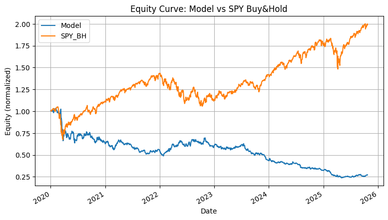
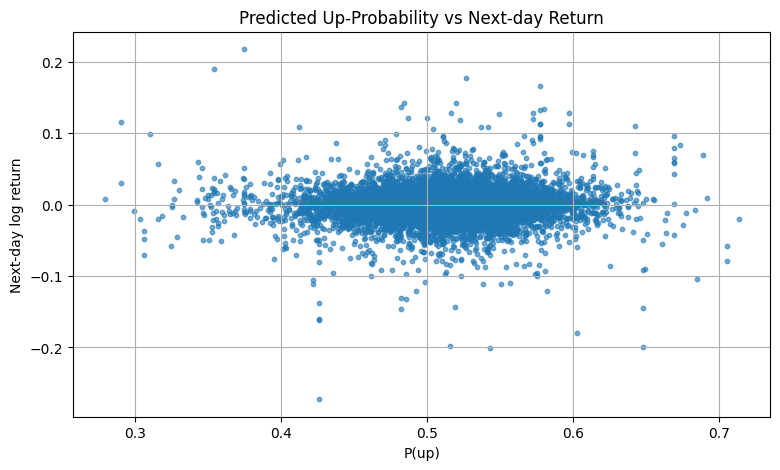
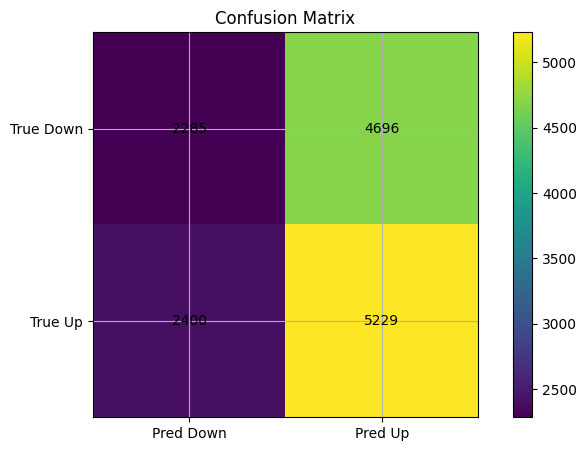
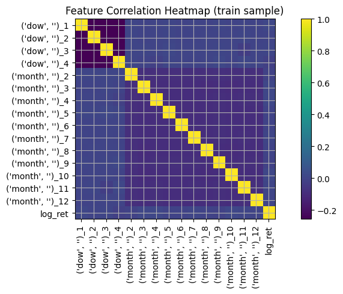
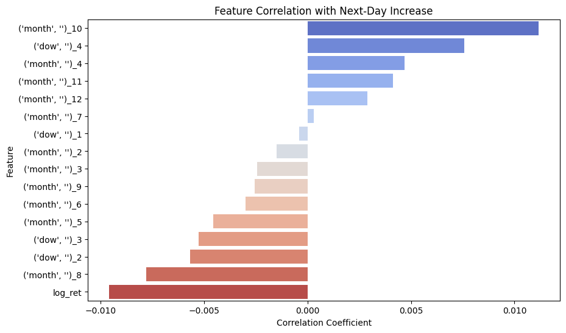

# Project title: Stonks

### Project Description:

This project explores the use of machine learning to predict short term stock movements and evaluate whether a model based approach can identify predictive patterns beyond random chance. Because financial markets is very noisy especially in the short term time frame, our goal is to test whether or not incorporating technical signals and calendar effects can improve next-day prediction. By including these features we can evaluate the usefulness of predictive pattern in financial data.

The initial analysis will start off with a subset of 10 companies from the fortune 500 list with each stock covering a different sector. This set will be later expanded to include additional stocks for greater diversity (i.e cover all different business sectors). We plan to use supervised learning methods (i.e classifications and regression) to evaluate predictive accuracy as well as risk-adjusted returns (i.e Sharpe ratio, max drawdown) The goal is to predict next-day stock returns using  OHLCV data, technical indicators, and calendar effects.

## Goal:

- Evaluate whether machine learning models can identify predictive patterns in short-term stock movements beyond random chance.
- Identify which technical indicators and calendar effects are most predictive of short-term price movements
- Test whether incorporating technical indicators and calendar effects improves next-day prediction accuracy.
- Test model performance using both predictive accuracy and risk-adjusted return metrics

## Required Data

- Historical trading data
    - Sources
        - Download data from yahoo finance
    - Fields
        - Open, high, low, close ,volume levels
    - Frequency
        - Daily data from 2000-2026
    - Universe
        - 10 companies from the fortune 500
        - s&p500 (SPY/VOO)
- Calendar effects
    - Day of week
    - Month of year / Seasons
- Technical indicators
    - Moving averages
    - Relative Strength Index
    - Volatility measures
    - Momentum indicators

## Data modeling

- Using a always up predictor
    - Used as a sanity check on to see if our xgboost even works correctly
- Using xgboost to learn and predict the next day direction
    - Using trees to learn the error of past trees and develops a spotting

## Data Visualization

- Line chart
    - Show difference in asset price between model and S&P
- Scatter plot
    - Predicted and actual returns for the model itself
- Heatmap
    - Correlations for classifications and to show relation between inputs (i.e RSI, volume, calendar effects)
- Confusion matrix
    - shows the model performance (i.e how often it correctly predicts if the stock is going to go up or down)

## Test plan

- Strategy
    - Each day, select top-3 predicted “up” stocks and buy them
    - Sell top 3 stocks that are predicted to go down
- Train on historical data
    - train on data from 1980-2019
- Validation
    - expanding window CV for data validation and to help mitigate overfitting
- Benchmarks
    - Compare to buy-and-hold SPY
- Backtest
    - Testing using more recent years (2020-2026)
    - Include transaction cost
        - .01-.05%
            - Allows for ensuring that the trades are actually profitable
    - Only allowed to see past data when testing and not current

**Equity Curve: Model vs SPY Buy&Hold**

This plot compares the cumulative returns of the model's trading strategy against a simple buy-and-hold strategy on the SPY benchmark over the backtest period (starting from 2020-01-01). The SPY buy-and-hold strategy shows a strong upward trend, indicating significant positive returns over the period. In contrast, the model's equity curve initially tracks SPY but then shows a significant divergence, underperforming the benchmark substantially and ending with a significant loss. This suggests that the current model, with its configuration and features, was not profitable during this specific backtest period and failed to capture the overall market trend represented by SPY. The maximum drawdown for the model is significantly larger than that of the SPY benchmark.

**Predicted Up-Probability vs Next-day Return**

This scatter plot visualizes the relationship between the model's predicted probability of an upward price movement and the actual realized next-day log return. Each point represents a prediction for a specific stock on a specific day during the backtest period. Ideally, we would expect to see a positive correlation: higher predicted probabilities of 'up' should generally correspond to higher positive next-day returns. However, the plot shows a wide dispersion of points with no clear discernible positive trend. Points with high predicted 'up' probabilities (close to 1.0) are associated with a wide range of actual returns, including significant negative returns. Similarly, points with low predicted 'up' probabilities (close to 0.0) also show a mix of positive and negative returns. This lack of a strong, consistent relationship suggests that while the model is outputting probabilities, those probabilities do not reliably correspond to the magnitude or even direction of the actual next-day return in the backtest data.

**Confusion Matrix (Backtest period)**

The confusion matrix provides a breakdown of the model's classification performance during the backtest period.
- Top-left (True Negative): The number of times the model predicted a downward move (Pred Down) and the actual move was downward (True Down).
- Top-right (False Positive): The number of times the model predicted an upward move (Pred Up) but the actual move was downward (True Down).
- Bottom-left (False Negative): The number of times the model predicted a downward move (Pred Down) but the actual move was upward (True Up).
- Bottom-right (True Positive): The number of times the model predicted an upward move (Pred Up) and the actual move was upward (True Up).

Based on the matrix values:
- The model has a higher number of True Positives compared to True Negatives, indicating it predicted upward moves more often than downward moves when they actually occurred.
- There is a significant number of False Positives and False Negatives, suggesting the model frequently misclassified the direction of price movements.
- The accuracy score of ~51.4% (as reported) is only slightly better than random chance (50%), and the precision (~52.7%) and recall (~68.5%) scores further highlight the model's limited ability to accurately predict the direction of next-day stock movements during this period.

**Feature Correlation Heatmap (train sample)**

This heatmap displays the pairwise correlations between the features used in the model, calculated on the training data prior to 2020. The diagonal shows a perfect positive correlation (1.0) of each feature with itself. Off-diagonal values indicate the strength and direction of linear relationships between different feature pairs.

Observations:
- The calendar dummy variables ('dow' and 'month') show expected negative correlations with each other within their respective groups (e.g., dow_1 is negatively correlated with dow_2), as they are one-hot encoded representations of mutually exclusive categories.
- Moving averages (sma_5, sma_10, sma_20) and Rate of Change (roc_3, roc_5, roc_10) show high positive correlations among themselves, especially within their respective groups (e.g., sma_5 is highly correlated with sma_10 and sma_20). This is expected as they are derived from the same underlying price data with varying window lengths. This high correlation among related technical indicators could suggest potential multicollinearity.
- Volatility measures (vol_10, vol_20) also show high positive correlation with each other.
- The 'log_ret' feature (representing the current day's log return) shows relatively low correlations with most other features, including the technical indicators and calendar dummies. This is not unexpected, as daily returns can be quite noisy and less directly correlated with smoothed indicators or calendar effects.

Overall, the heatmap highlights expected correlations among groups of technical indicators. While high correlation among features doesn't necessarily break XGBoost, it's worth noting for potential future feature selection or alternative modeling approaches. There are no alarmingly high correlations that suggest immediate data quality issues, but the relationships between technical indicators are evident.

### Detailed description of data processing done so far

**Data Ingestion:**
Historical daily Open, High, Low, Close, Adjusted Close, and Volume (OHLCV) data for a selected universe of 10 sector-diverse large-cap stocks and the SPY benchmark were downloaded using the `yfinance` library. The data covers the period from January 1, 2000, to December 31, 2026, providing a comprehensive historical dataset for analysis and backtesting. Each ticker's data was stored in a separate pandas DataFrame within a dictionary.

**Feature Engineering:**
A variety of technical and calendar-based features were engineered from the raw OHLCV data to potentially capture predictive patterns in stock price movements:
- **Daily Log Return:** Calculated as the difference of the natural logarithm of consecutive closing prices (`np.log(out["close"]).diff()`). This represents the continuous compounded return for the day and is a fundamental measure of daily price change.
- **Moving Averages (SMA):** Simple Moving Averages for periods of 5, 10, and 20 days were computed (`out["close"].rolling(w).mean()`). SMAs smooth out price data to identify trends; shorter periods are more sensitive to recent price changes, while longer periods indicate broader trends.
- **Momentum (ROC):** Rate of Change for periods of 3, 5, and 10 days was calculated (`out["close"].pct_change(w)`). ROC measures the percentage change in price over a given period, indicating the speed of price movement.
- **Volatility (Rolling Std):** The rolling standard deviation of daily log returns over 10 and 20 days was computed (`out["log_ret"].rolling(w).std()`). This feature measures the dispersion of returns, serving as an indicator of market risk or instability.
- **Relative Strength Index (RSI):** A simplified 14-period RSI was calculated based on the ratio of average gains to average losses over the period. RSI is a momentum oscillator that measures the speed and change of price movements, often used to identify overbought or oversold conditions.
- **Calendar Dummies:** One-hot encoded dummy variables were created for the day of the week and month (`pd.get_dummies(out, columns=["dow", "month"], drop_first=True)`). These capture potential calendar effects or seasonal patterns in stock returns.

**Handling of Missing Values (NaNs):**
After the feature engineering process, which inherently creates missing values (NaNs) due to the rolling window calculations and differencing, rows containing any NaN values were removed from the data using the `dropna()` method (`out = out.dropna()`). This ensures that the dataset used for modeling contains complete information for all features. Additionally, during the assembly of the panel data, rows with NaNs in the target variables (`y_reg`, `y_cls`) were also removed to ensure valid labels for training and evaluation.

### Detailed description of data modeling methods used so far

**Expanding-Window Cross-Validation Protocol:**
An expanding-window cross-validation approach is used for backtesting the trading strategy. This method simulates a real-world trading scenario by progressively increasing the training data window over time while keeping the test window fixed at a single trading day. Specifically, for each trading day in the backtest period (starting from `CONFIG["backtest_start"]`), the model is trained on all data available *up to the day before* the current backtest day. Predictions are then made for the current day. This process is repeated for every day in the backtest period, ensuring that the model is only trained on historical data available at the time of prediction, avoiding look-ahead bias. This approach provides a more realistic evaluation of the strategy's performance over time compared to a fixed train/test split.

**Baseline Models:**
Two baseline models are used for comparison to evaluate whether the machine learning strategy adds value:
- **Always-Up Classifier:** This simple baseline predicts that the next-day stock movement will always be upward (class 1) for all stocks on all days. This provides a benchmark for classification accuracy against a naive prediction strategy.
- **SPY Buy-and-Hold Strategy:** This represents a passive investment strategy where an investor simply buys and holds shares of the SPY ETF (the benchmark for the universe) over the entire backtest period. The cumulative return and risk metrics (like Sharpe Ratio and Max Drawdown) of this strategy serve as a benchmark for the trading strategy's investment performance.

**XGBoost Classification Model:**
An XGBoost (`XGBClassifier`) model is employed for predicting the direction of the next-day stock movement (up or down). This is a gradient boosting algorithm known for its performance and efficiency.
- **Objective Function:** The model uses "binary:logistic", which is suitable for binary classification tasks and outputs probabilities.
- **Evaluation Metric:** During training, "logloss" is used as the evaluation metric to measure the performance of the classification model.
- **Key Hyperparameters:** The model is configured with `n_estimators=300` (number of boosting rounds), `max_depth=4` (maximum depth of the trees), `learning_rate=0.05` (step size shrinkage), `subsample=0.9` (fraction of samples used per tree), and `colsample_bytree=0.9` (fraction of features used per tree). These parameters are set to reasonable values to prevent overfitting and improve generalization.

Within the walk-forward backtest, the trained XGBoost model predicts the probability of an upward movement (`p_up`) for each stock on the current backtest day. Based on these probabilities, the trading strategy selects the top-K stocks with the highest predicted `p_up` for long positions and (if `long_short` is enabled) the top-K stocks with the lowest predicted `p_up` for short positions. The daily portfolio return is then calculated based on the actual next-day returns of these selected stocks, adjusted for transaction costs.
"""

### Preliminary Results

Based on the walk-forward backtest conducted from 2020-01-01 onwards, the preliminary results for the XGBoost classification trading strategy are as follows:

- **Strategy Sharpe Ratio (Annualized):** -0.895
- **Strategy Max Drawdown:** -77.07%
- **Classification Metrics (Backtest Period):**
    - Accuracy: 0.514
    - Precision: 0.527
    - Recall: 0.685

**Interpretation:**

The equity curve plot clearly illustrates that the model's trading strategy significantly underperformed the SPY buy-and-hold benchmark during the backtest period. While SPY showed a strong positive trend and ended with substantial cumulative gains, the model's equity curve declined significantly, resulting in a large loss by the end of the backtest.

The calculated performance metrics corroborate this underperformance. The **Sharpe Ratio** of -0.895 is negative, indicating that the strategy's returns were less than the risk-free rate (implicitly assumed to be 0 in the calculation) and that it generated poor risk-adjusted returns. A negative Sharpe Ratio is a strong indicator that the strategy was not profitable on a risk-adjusted basis during this period.

The **Max Drawdown** of -77.07% is substantial, indicating a severe peak-to-trough decline in the strategy's equity. This large drawdown signifies significant risk and capital impairment experienced by the strategy's portfolio. Compared to the SPY benchmark (which also experienced drawdowns but ended with positive overall returns), the model's drawdown is indicative of its failure to navigate market downturns or capitalize on upward trends effectively.

The **classification metrics** provide insight into the model's ability to predict the direction of next-day stock movements. An **Accuracy** of 0.514 is only slightly better than random chance (0.50), suggesting the model struggles to correctly predict whether a stock will go up or down. The **Precision** of 0.527 indicates that when the model predicts an upward move, it is only correct about 52.7% of the time. The **Recall** of 0.685 suggests the model is able to capture about 68.5% of the actual upward moves. These classification scores are relatively low and highlight the model's limited predictive power, which directly impacts the performance of the trading strategy that relies on these predictions.

**Conclusion on Promising Results:**

Based on the analyzed metrics and the equity curve, the preliminary backtest results are **not promising** for a real-world trading strategy in their current state. The negative Sharpe Ratio, large maximum drawdown, and significant underperformance relative to the benchmark all indicate a lack of profitability and high risk during the backtest period. The modest classification metrics suggest that the underlying model's predictive capability is weak, which is likely a primary driver of the poor trading performance. Further feature engineering, model tuning, or exploring alternative modeling approaches would be necessary to potentially develop a profitable and robust trading strategy.
